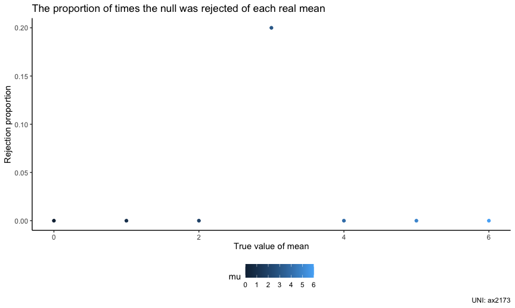
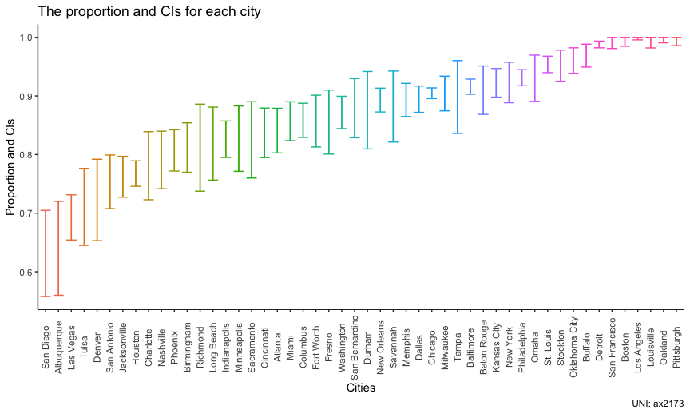

p8015_hw5_ax2173
================

``` r
library(tidyverse)
```

    ## ── Attaching packages ─────────────────────────────────────── tidyverse 1.3.2 ──
    ## ✔ ggplot2 3.3.6      ✔ purrr   0.3.5 
    ## ✔ tibble  3.1.8      ✔ dplyr   1.0.10
    ## ✔ tidyr   1.2.1      ✔ stringr 1.4.1 
    ## ✔ readr   2.1.2      ✔ forcats 0.5.2 
    ## ── Conflicts ────────────────────────────────────────── tidyverse_conflicts() ──
    ## ✖ dplyr::filter() masks stats::filter()
    ## ✖ dplyr::lag()    masks stats::lag()

``` r
library(rvest)
```

    ## 
    ## Attaching package: 'rvest'
    ## 
    ## The following object is masked from 'package:readr':
    ## 
    ##     guess_encoding

``` r
library(patchwork)

knitr::opts_chunk$set(
  fig.width = 6,
  fig.asp = .6,
  out.width = '90%'
)

theme_set(theme_classic() + theme(legend.position = 'bottom'))

options(
  ggplot2.continous.colour = 'viridis_d',
  ggplot2.continous.fill = 'viridis_d'
)

scalr_colour_discrete = scale_color_viridis_d
scale_fill_discrete = scale_fill_viridis_d

set.seed(1)
```

## Problem 1

## Problem 2

Import data.

``` r
homicide_df = read_csv("./data/homicide-data.csv")
```

    ## Rows: 52179 Columns: 12
    ## ── Column specification ────────────────────────────────────────────────────────
    ## Delimiter: ","
    ## chr (9): uid, victim_last, victim_first, victim_race, victim_age, victim_sex...
    ## dbl (3): reported_date, lat, lon
    ## 
    ## ℹ Use `spec()` to retrieve the full column specification for this data.
    ## ℹ Specify the column types or set `show_col_types = FALSE` to quiet this message.

-   There are some descriptions about the raw data:
    -   There are totally 12 columns.
    -   There are totally 52179 rows.
    -   In this dataframe, these variables can be found: uid,
        reported_date, victim_last, victim_first, victim_race,
        victim_age, victim_sex, city, state, lat, lon, disposition.

Create a city_state variable.

``` r
homicide_df =
  homicide_df %>% 
  mutate(city_state = str_c(city, ', ',state))
```

Summarize within cities to obtain the total number of homicides and the
number of unsolved homicides.

``` r
count_homicide_df = 
  homicide_df %>%  
  mutate(
    homicide = ifelse(disposition == "Closed without arrest", 1, 0),
    unsolved_homicides = ifelse(disposition == "Open/No arrest", 1, 0)
    ) %>% 
  group_by(city) %>% 
  summarize(
    n_homicides = sum(homicide),
    n_unsolved_homicides = sum(unsolved_homicides),
    n_total = n_homicides + n_unsolved_homicides
   ) 

count_homicide_df %>% 
  knitr::kable()
```

| city           | n_homicides | n_unsolved_homicides | n_total |
|:---------------|------------:|---------------------:|--------:|
| Albuquerque    |          52 |                   94 |     146 |
| Atlanta        |          58 |                  315 |     373 |
| Baltimore      |         152 |                 1673 |    1825 |
| Baton Rouge    |          16 |                  180 |     196 |
| Birmingham     |          64 |                  283 |     347 |
| Boston         |           0 |                  310 |     310 |
| Buffalo        |           8 |                  311 |     319 |
| Charlotte      |          44 |                  162 |     206 |
| Chicago        |         387 |                 3686 |    4073 |
| Cincinnati     |          49 |                  260 |     309 |
| Columbus       |          80 |                  495 |     575 |
| Dallas         |          78 |                  676 |     754 |
| Denver         |          46 |                  123 |     169 |
| Detroit        |          16 |                 1466 |    1482 |
| Durham         |          11 |                   90 |     101 |
| Fort Worth     |          35 |                  220 |     255 |
| Fresno         |          23 |                  146 |     169 |
| Houston        |         346 |                 1147 |    1493 |
| Indianapolis   |         102 |                  492 |     594 |
| Jacksonville   |         141 |                  456 |     597 |
| Kansas City    |          36 |                  450 |     486 |
| Las Vegas      |         175 |                  397 |     572 |
| Long Beach     |          27 |                  129 |     156 |
| Los Angeles    |           0 |                 1106 |    1106 |
| Louisville     |           0 |                  261 |     261 |
| Memphis        |          50 |                  433 |     483 |
| Miami          |          63 |                  387 |     450 |
| Milwaukee      |          37 |                  366 |     403 |
| Minneapolis    |          31 |                  156 |     187 |
| Nashville      |          57 |                  221 |     278 |
| New Orleans    |          98 |                  832 |     930 |
| New York       |          17 |                  226 |     243 |
| Oakland        |           0 |                  508 |     508 |
| Oklahoma City  |          11 |                  315 |     326 |
| Omaha          |          10 |                  159 |     169 |
| Philadelphia   |          92 |                 1268 |    1360 |
| Phoenix        |          96 |                  408 |     504 |
| Pittsburgh     |           0 |                  337 |     337 |
| Richmond       |          20 |                   93 |     113 |
| Sacramento     |          23 |                  116 |     139 |
| San Antonio    |          87 |                  270 |     357 |
| San Bernardino |          19 |                  151 |     170 |
| San Diego      |          64 |                  111 |     175 |
| San Francisco  |           1 |                  335 |     336 |
| Savannah       |          12 |                  103 |     115 |
| St. Louis      |          40 |                  865 |     905 |
| Stockton       |          11 |                  255 |     266 |
| Tampa          |           8 |                   87 |      95 |
| Tulsa          |          55 |                  138 |     193 |
| Washington     |          74 |                  515 |     589 |

For the city of Baltimore, MD, estimate the proportion of homicides that
are unsolved.

``` r
prop_of_unsolved_homicides = 
  prop.test(1673, 1673 + 152, alternative = c("two.sided"), conf.level = 0.95) %>% 
  broom::tidy()
```

-   For the city of Baltimore, MD, the estimated proportion of homicides
    that are unsolved is 0.9167123.
-   The confidence interval is (0.9028507, 0.9287857)

Now run prop.test for each of the cities in dataset, and extract both
the proportion of unsolved homicides and the confidence interval for
each. \* NOTICE!!! \* The estimate column shows the required proportion
of unsolved homicides. \* The conf.low column shows the required the
lower bond of CI of each city. \* The conf.high column shows the
required the higher bond of CI of each city.

``` r
prop_test = function(data) {
  
  prop.test(data$n_unsolved_homicides, data$n_total, alternative = c("two.sided"), conf.level = 0.95) 
}

count_homicide_df = 
  count_homicide_df %>% 
  nest(data = n_homicides : n_total) %>% 
  mutate(
    prop = map(data, prop_test),
    results = map(prop, broom::tidy)
  ) %>% 
  select(-data, -prop) %>% 
  unnest(results) %>% 
  select(city, estimate, conf.low, conf.high)
```

## Problem 3

``` r
t_test = function(sample_size, mun, sigma) {
  
  x = rnorm(n = sample_size, mean = mun, sd = sigma)
  
  t.test(x, mu = mun, conf.level = 0.95) %>% 
    broom::tidy() %>% 
    select(estimate, p.value)
  
}

t_test_result_0 = 
  rerun(5, t_test(sample_size = 30, mu = 0, sigma = 5)) %>% 
  bind_rows
```

Repeat the above for mu = {1,2,3,4,5,6}.

``` r
t_test_result = 
  tibble(
    mu = c(0, 1, 2, 3, 4, 5, 6)
  ) %>% 
  mutate(
    output_lists = map(.x = mu, ~rerun(5, t_test(sample_size = 30, mun = .x, sigma = 5))),
    estimate_df = map(output_lists, bind_rows)
  ) %>% 
  select(-output_lists) %>% 
  unnest(estimate_df)
```

Make a plot showing the proportion of times the null was rejected (the
power of the test) on the y axis and the true value of μ on the x axis.
\* We can find the association between the effect size and power: under
the same sample size, with the increase of effect size, the power grows.

``` r
t_test_result %>% 
  mutate(
    if_rejected = ifelse(p.value < 0.05, 1, 0)
      ) %>% 
  group_by(mu) %>% 
  summarize(
    n_rejected = sum(if_rejected),
    prop_rejected = n_rejected / 5
    ) %>% 
  ggplot(aes(x = mu, y = prop_rejected, color = mu)) +
  geom_point() +
    labs(
    title = 'The proportion of times the null was rejected of each real mean',
    x = 'True value of mean',
    y = 'Rejection proportion',
    caption = 'UNI: ax2173'
  )
```



Make a plot showing the average estimate of μ̂ on the y axis and the true
value of μ on the x axis. Make a second plot the average estimate of μ̂
only in samples for which the null was rejected on the y axis and the
true value of μ on the x axis.

Is the sample average of μ̂ across tests for which the null is rejected
approximately equal to the true value of μ? Why or why not?

``` r
plot_with_all_mu =   
  t_test_result %>% 
  group_by(mu) %>% 
  summarize(
    ave_estimate = mean(estimate)
  ) %>% 
  ggplot(aes(x = mu, y = ave_estimate, color = mu)) +
  geom_point() +
    labs(
    title = 'The average estimate mu vs. true value of mu',
    x = 'The true value of mu',
    y = 'The average estimate of mu',
    caption = 'UNI: ax2173'
  )

plot_with_rejected_mu = 
  t_test_result %>% 
  filter(p.value <= 0.05) %>% 
  group_by(mu) %>% 
  summarize(
    ave_estimate = mean(estimate)
  ) %>% 
  ggplot(aes(x = mu, y = ave_estimate, color = mu)) +
  geom_point() +
    labs(
    title = 'The average estimate rejected mu vs. true value of mu',
    x = 'The true value of mu',
    y = 'The average estimate of rejected mu',
    caption = 'UNI: ax2173'
  )

plot_with_all_mu + plot_with_rejected_mu
```



The sample average of mu across test for which the null is rejected is
not approximately equal to the true value of mean. Maybe because if
these estimate mu is roughly equal to the true mean, their null will not
be rejected.
